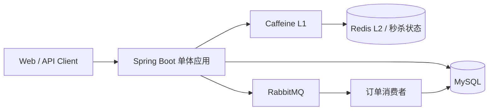
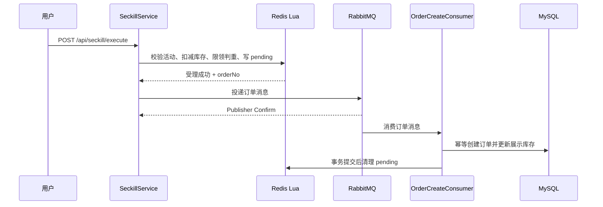

# 校园生活服务与营销平台

基于 Spring Boot 的单体 Java 后端项目，面向校园商户与学生用户，提供店铺查询、用户点评、优惠券秒杀与订单处理能力。项目重点实现优惠券查询缓存、抢券原子校验、异步订单创建与异常补偿，适合作为 Java 后端校招项目展示。

> 项目保持单体 Spring Boot 架构；不涉及微服务、高可用集群或 Kubernetes 等未实现能力。

## 技术栈

- Java 17、Spring Boot 3.2、Spring MVC、Spring Data JPA
- MySQL 8：用户、商户、优惠券、订单等持久化数据
- Redis、Lua：登录会话、秒杀状态、库存扣减和一人限领校验
- Caffeine、Redisson：热点活动 L1 + L2 缓存与缓存重建互斥
- RabbitMQ：异步订单创建、发布确认、死信队列
- Maven、JUnit 5、Mockito：构建与关键链路单元测试

## 已实现的核心业务

| 业务 | 说明 |
| --- | --- |
| 用户与商户 | 注册、登录、Token 刷新、登出；商户可维护店铺、商品和优惠券。 |
| 商品、店铺与活动查询 | 商户商品查询、店铺点评查询、进行中优惠券查询、优惠券详情查询。 |
| 用户点评 | 普通用户可按店铺发布 1–5 星文字点评，并查询店铺的时间倒序点评列表。 |
| 优惠券秒杀 | Lua 在 Redis 内完成活动状态、时间窗口、库存和每人限领校验，并写入待投递记录。 |
| 异步订单 | 抢券受理后投递 RabbitMQ；消费者以订单号作为幂等键创建订单，并同步展示库存。 |
| 异常补偿 | Confirm/Return 与 Redis pending 状态配合；定时任务重投超过宽限期或不可路由的待处理订单。 |

## 架构与关键链路



### 优惠券秒杀 → 异步订单



Lua 保证 Redis 内该段操作的原子性；RabbitMQ 按至少一次投递处理，消费者通过 `order_no` 唯一约束/幂等插入抵御重复投递。详细说明见 [docs/architecture.md](docs/architecture.md)。

## 模块说明

```text
src/main/java/com/seckill/
├── controller/    REST 接口
├── service/       登录、缓存、秒杀、订单与 pending 补偿
├── cache/         Caffeine 热点缓存与热键检测
├── interceptor/   Redis Token 校验与 UserContext 生命周期
├── scheduler/     活动生命周期与 pending 订单恢复
├── repository/    JPA 数据访问
└── config/        Redis、RabbitMQ、Web MVC 等配置

src/main/resources/
├── lua/           秒杀校验、pending 状态迁移脚本
└── sql/           初始化 SQL 与迁移脚本
```

## 本地启动

### 1. 前置条件

- JDK 17、Maven 3.9+
- MySQL 8、Redis、RabbitMQ（management 插件可选）

复制配置示例并替换占位值。真实本地配置文件不会提交：

```powershell
Copy-Item src/main/resources/application-example.yml src/main/resources/application-local.yml
```

也可以只设置环境变量；基础 `application.yml` 会从环境读取数据库、RabbitMQ 与 JWT 配置。

```powershell
$env:SPRING_DATASOURCE_URL = 'jdbc:mysql://127.0.0.1:3306/seckill?useUnicode=true&characterEncoding=utf-8&serverTimezone=Asia/Shanghai'
$env:MYSQL_USER = 'root'
$env:MYSQL_PASSWORD = '<your-mysql-password>'
$env:RABBITMQ_USER = 'admin'
$env:RABBITMQ_PASSWORD = '<your-rabbitmq-password>'
$env:JWT_SECRET = '<at-least-32-random-characters>'
```

当前代码会初始化已有的 AI `ChatClient` Bean，因此本地启动还需设置非空的 `DEEPSEEK_API_KEY`。它不属于本 README 的核心展示能力；如需将其完全改为可选启动，应另行做条件装配改造。

### 2. 初始化数据库并启动

```powershell
mysql -u root -p -h 127.0.0.1 -P 3306 < src/main/resources/sql/init.sql
mvn spring-boot:run -Dspring-boot.run.profiles=local
```

如果未创建 `application-local.yml`，移除 `-Dspring-boot.run.profiles=local` 并使用上面的环境变量启动。

服务默认监听 `http://localhost:8080`，健康检查为 `GET /actuator/health`。

## 常用接口

除登录、注册与健康检查外，接口需携带 `Authorization: Bearer <accessToken>`。

| 方法 | 路径 | 说明 |
| --- | --- | --- |
| `POST` | `/api/auth/register` | 注册用户或商户 |
| `POST` | `/api/auth/login` | 登录并获取 Redis 会话 Token |
| `GET` | `/api/merchant/list` | 查询商户列表 |
| `GET` / `POST` | `/api/merchant/{merchantId}/reviews` | 查询店铺点评 / 发布当前用户点评 |
| `GET` | `/api/product/shop/{merchantId}` | 查询商户商品 |
| `GET` | `/api/coupon/active` | 查询进行中优惠券 |
| `GET` | `/api/coupon/{couponId}` | 查询优惠券详情（缓存链路） |
| `POST` | `/api/seckill/execute` | 提交抢券请求 |
| `GET` | `/api/seckill/result/{orderNo}` | 轮询异步订单结果 |
| `GET` | `/api/order/user` | 查询当前用户订单 |

## 验证与性能资料

关键单元测试覆盖 Lua 脚本契约、发布确认、消费者幂等、pending 状态迁移、登录拦截器上下文清理与逻辑过期缓存刷新：

```powershell
mvn test
```

仓库保留了本机单实例的历史性能测试报告和脚本；测试条件、可复现命令和结果边界见 [docs/performance.md](docs/performance.md)。其中数据仅适用于所记录环境，不能外推为生产容量。

## 面试说明

- 先讲业务问题：高并发抢券需要同时处理库存、限领与异步落单。
- 再讲实现边界：Redis Lua 只覆盖 Redis 内的原子受理；跨 Redis、MQ、MySQL 不使用分布式事务，而以 pending 补偿和消费者幂等处理失败与重复投递。
- 最后讲证据：代码位于 `SeckillService`、`OrderCreateConsumer`、`PendingOrderRecoveryScheduler`，对应测试位于 `src/test/java/com/seckill/service/`。

## 资料

- [架构与链路说明](docs/architecture.md)
- [性能测试说明](docs/performance.md)
- [配置示例](src/main/resources/application-example.yml)
