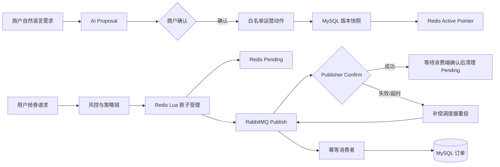

# XG2JD

> 面向校园生活场景的优惠活动与商户运营平台。项目围绕高并发抢券、可靠异步下单、活动生命周期缓存和受控 AI 运营执行构建，重点展示 Java 后端在一致性、性能与工程治理上的实现能力。

<p align="center">
  
  
  
  
  
</p>

## 为什么做这个项目

一个优惠活动平台的难点不只是“把请求打到 Redis”。它需要同时处理：

- 高并发下的库存正确性和一人一单；
- Redis 成功扣减后，应用崩溃或 MQ 确认延迟造成的投递空窗；
- 至少一次投递语义带来的重复消费；
- 活动配置频繁变更时，缓存读写的一致性与热点保护；
- AI 从“能回答”到“可以受控执行”的权限、确认和审计边界。

XG2JD 将这些问题组织为可运行、可测试、可复现的业务链路，而不是彼此孤立的技术样例。

## 核心能力

| 领域 | 实现 |
| --- | --- |
| 高并发抢券 | Redis Lua 在单次原子执行中完成状态校验、时间窗口、库存扣减、一人一单判重和 pending 记录写入。 |
| 可靠异步下单 | publisher confirm 与 Redis pending 状态流转协作；失败/超时任务指数退避重投，消费者按订单号幂等。 |
| 缓存一致性 | Caffeine L1 + Redis L2 读取活动静态规则；Redis 版本指针切换不可变快照，库存与资格不进入本地缓存。 |
| 生命周期治理 | 活动创建、修改、暂停、恢复和回滚都会生成版本快照；逻辑过期与异步刷新降低热点失效冲击。 |
| 运营 AI | AI 仅生成结构化 Proposal；商户确认后才进入白名单业务工具，任务、动作和结果可审计。 |
| 风控与观测 | Sentinel、设备指纹、Bloom Filter 预筛、Actuator、Micrometer/Prometheus、通知与补偿调度。 |

## 系统架构



### 秒杀状态流转

```text
HTTP Request
  -> Token / 风控 / 用户策略
  -> Redis Lua: 校验 + 扣库存 + 判重 + pending
  -> RabbitMQ Publish
  -> Publisher Confirm
  -> Consumer MySQL Transaction
  -> Pending 状态确认与清理
```

Redis Lua 保证库存和资格的原子性；RabbitMQ 保证异步解耦；pending 状态机负责补足 Redis 与 MQ 之间不存在分布式事务的空窗；数据库唯一约束和业务幂等共同处理重复投递。

## 技术栈

| 模块 | 技术 |
| --- | --- |
| 后端 | Java 17, Spring Boot 3.2, Spring MVC, Spring Data JPA |
| 数据与缓存 | MySQL 8, Redis, Caffeine, Redisson, Lettuce |
| 消息与调度 | RabbitMQ, Spring AMQP, Spring Scheduling |
| 并发与治理 | Redis Lua, Sentinel, Guava Bloom Filter, JPA `@Version` |
| AI 与可观测性 | Spring AI, DeepSeek-compatible API, Actuator, Micrometer, Prometheus |
| 前端与部署 | React, Vite, Docker Compose |

## 已验证的本地基准

以下数据来自 2026-08-28 的同机、本地、单 Spring Boot 实例复测。每个采用值取三轮 65 秒正式采样的中位数，不代表生产集群容量。

| 场景 | 参数 | 结果 |
| --- | --- | --- |
| 活动详情 MySQL 直查 | 100 并发 | 4.3k QPS, P99 44 ms |
| Redis 缓存读取 | 100 并发 | 10.5k QPS, P99 12 ms |
| Caffeine + Redis 读取 | 100 并发 | 12.8k QPS, P99 10 ms, L1 命中率约 99.99% |
| Redis Lua 完整受理路径 | 50 并发 | 690 QPS, P99 108 ms, 系统错误率 0 |
| 一致性验收 | Lua 三轮 x 4 档 | 无超卖、无重复领取、pending 清零 |
| MQ 可靠性验收 | 5,000 独立用户 | 5,000 有效订单，无重复订单，pending 与 DLQ 清零 |

详细的测试口径、环境、三轮波动和复现入口见 [性能测试交接文档](docs/PERFORMANCE_TEST_HANDOVER.md)。原始 JTL 含短期 Token，因此只保留在 Git 忽略目录，不进入仓库。

## 快速开始

### 1. 准备配置

需要 Docker Compose。创建本地 `.env`，不要提交该文件：

```dotenv
MYSQL_ROOT_PASSWORD=change-me
RABBITMQ_PASSWORD=change-me
JWT_SECRET=replace-with-a-random-secret-at-least-32-characters
# 可选：不配置时 AI 功能会降级，不调用外部模型
DEEPSEEK_API_KEY=
```

### 2. 启动依赖和应用

```bash
docker compose up -d --build
docker compose ps
```

服务启动后：

| 地址 | 用途 |
| --- | --- |
| `http://localhost:8080/` | Web 应用 |
| `http://localhost:8080/actuator/health` | 健康检查 |
| `http://localhost:15672/` | RabbitMQ 管理台 |

查看日志或停止服务：

```bash
docker compose logs -f app
docker compose down
```

可选启动 Prometheus 与 Grafana：

```bash
docker compose --profile observability up -d
```

### 3. 本地开发模式

本机启动 MySQL、Redis、RabbitMQ 后，先导入初始化数据并设置必需环境变量：

```bash
mysql -u root -p -h 127.0.0.1 -P 3306 < src/main/resources/sql/init.sql

export SPRING_DATASOURCE_URL='jdbc:mysql://127.0.0.1:3306/seckill?useUnicode=true&characterEncoding=utf-8&serverTimezone=Asia/Shanghai'
export MYSQL_USER=root
export MYSQL_PASSWORD='<local mysql password>'
export RABBITMQ_USER=admin
export RABBITMQ_PASSWORD='<local rabbitmq password>'
export JWT_SECRET='<random secret with at least 32 characters>'
export DEEPSEEK_API_KEY='<optional deepseek api key>'
mvn spring-boot:run
```

前端独立开发：

```bash
cd frontend
npm install
npm run dev
```

## 关键接口

| API | 方法 | 描述 |
| --- | --- | --- |
| `/api/auth/login` | `POST` | 登录并获取 Token |
| `/api/coupon/{couponId}` | `GET` | 查询版本化活动详情 |
| `/api/seckill/execute` | `POST` | 抢券并返回订单号 |
| `/api/seckill/result/{orderNo}` | `GET` | 查询异步订单状态 |
| `/api/ai/tasks` | `POST` / `GET` | 创建与查询 AI 运营任务 |
| `/api/ai/tasks/{taskNo}/confirm` | `POST` | 人工确认并执行 Proposal |
| `/api/coupon/{couponId}/versions` | `GET` | 查询活动版本历史 |
| `/api/coupon/{couponId}/rollback/{version}` | `POST` | 从历史快照发布新版本 |

接口权限、示例账号、排障方式及业务细节见 [项目交接文档](docs/PROJECT_HANDOFF.md)。

## 性能与可靠性复现

`perf/` 负责活动详情缓存对比；`performance-test/` 负责完整抢券受理、Lua 一致性审计和 RabbitMQ 验收。

```bash
# 缓存矩阵：MySQL / Redis / Caffeine + Redis
./perf/run-cache-matrix.sh cache_<date>

# Lua 稳定矩阵：真实 HTTP 受理路径
./performance-test/scripts/run-lua-matrix.sh lua_<date>
```

正式复测应使用 `perf` profile，并遵循 [性能测试交接文档](docs/PERFORMANCE_TEST_HANDOVER.md) 的预热、清理、三轮重复和数据安全要求。

## 项目结构

```text
src/main/java/com/seckill/
├── cache/        # 活动快照、热点探测与两级缓存
├── config/       # Redis、RabbitMQ、鉴权、监控配置
├── controller/   # REST API 与 perf profile 专用夹具接口
├── scheduler/    # pending 补偿、活动生命周期、任务恢复
├── service/      # 秒杀、订单、缓存、AI 执行等核心逻辑
├── strategy/     # 风控与用户分配策略链
└── perf/         # 消费端性能与幂等指标

src/main/resources/lua/
├── check_qualify.lua             # 原子抢券与 pending 创建
└── pending_order_transition.lua  # pending 状态迁移

perf/                 # 缓存性能测试
performance-test/     # JMeter、测试夹具与稳定性测试脚本
docs/                 # 项目和性能交接文档
```

## 工程约束

- 原始 JTL、请求 CSV 和本地 `.env` 均可能包含短期 Token 或凭据，已被 Git 忽略。
- 缓存数据仅缓存活动静态规则；库存、领取资格和订单状态始终通过 Redis/MySQL 的实时逻辑判断。
- RabbitMQ 采用至少一次投递语义，业务侧必须通过订单号幂等和唯一约束处理重复消费。
- 本项目的性能数字仅适用于记录的本机环境；生产容量需要独立的多机压测、监控与容量评估。

---

有关可靠状态流转、缓存策略或受控 AI 执行的实现讨论，欢迎通过 Issue 交流。
