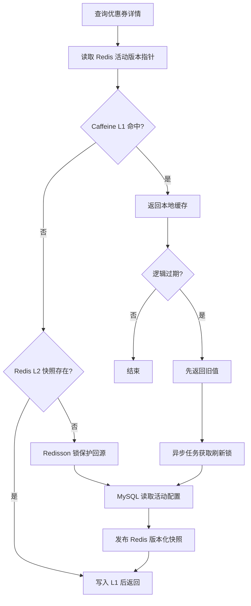
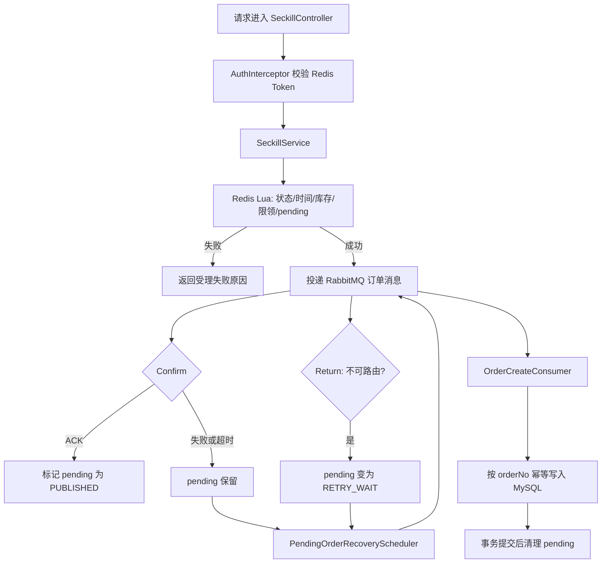

# 架构与关键链路

## 应用边界

本项目是一个 Spring Boot 单体应用。HTTP 接口、缓存访问、消息投递、订单消费和定时补偿均在同一应用代码库中；MySQL、Redis 与 RabbitMQ 是外部依赖服务。

当前核心实体为用户、商户、商品、优惠券和订单。本文只描述已由代码实现的缓存查询与优惠券秒杀链路。

## 优惠券详情缓存

`CouponCacheService#getCouponDetail` 的读取顺序为：

1. 根据活动 ID 读取 Redis 中的当前版本指针。
2. 使用版本化键查询 Caffeine L1；命中直接返回。
3. L1 未命中时读取 Redis L2 的不可变活动快照。
4. L2 缺失时，用 Redisson 锁限制同一键的并发重建，回源 MySQL 后发布快照。

活动配置发布时，代码先写入完整的版本化 Redis 快照，再切换活动版本指针，最后失效本地缓存并广播失效消息。缓存中只放活动展示与规则字段；库存、领取资格和订单状态仍以 Redis Lua 或 MySQL 的实时状态为准。

对热点键，`HotKeyCacheManager` 会在逻辑过期后先返回短暂的旧值，并由异步任务在 Redisson 锁保护下刷新。物理过期时间仍作为兜底，避免旧数据无限保留。

## 秒杀与异步下单

### Redis Lua 的职责

`lua/check_qualify.lua` 在一个 Redis 脚本中依次完成：

- 校验活动状态与时间窗口；
- 校验库存与每用户领取上限；
- 扣减 Redis 库存、记录用户领取标记；
- 创建带 `orderNo` 的 pending 记录，并写入恢复调度索引。

因此，同一 Redis 实例上的库存扣减、限领标记和 pending 创建是原子执行的。该结论不等价于跨 MySQL 与 RabbitMQ 的全局事务。

### 消息投递、补偿与幂等

- 首次投递后，`SeckillService` 等待 RabbitMQ publisher confirm；超时或失败时不直接回补 Redis 库存，而是保留 pending 记录。
- `RabbitReturnCallbackHandler` 接收不可路由的 Return 回调，将对应 pending 转为 `RETRY_WAIT`，仍交由恢复任务处理；这要求消息携带订单号关联 ID，且 `RabbitTemplate` 开启 mandatory。
- `PendingOrderRecoveryScheduler` 扫描超期 pending，声明恢复租约后重新投递。状态变更由 `lua/pending_order_transition.lua` 完成。
- `OrderCreateConsumer` 在事务中调用 `insertCouponClaimIfAbsent(orderNo, ...)`。订单号已存在时不再重复同步库存、写事件日志；事务提交后才确认并清理 pending。

这里的保障是“按至少一次投递处理、业务侧幂等”。消息系统或进程故障的最终行为仍依赖外部服务可用与恢复任务持续运行。

## 登录态与上下文

登录后 `TokenService` 生成随机 Token，并将用户 ID、用户名和角色写入 Redis，设置 TTL。`AuthInterceptor` 从 `Authorization: Bearer` 读取 Token、续期 Redis 会话并写入 `UserContext`。请求完成时通过 `afterCompletion` 清除 `ThreadLocal`，避免容器线程复用时串用户上下文。

对应单元测试位于 `src/test/java/com/seckill/config/AuthInterceptorTest.java`。
